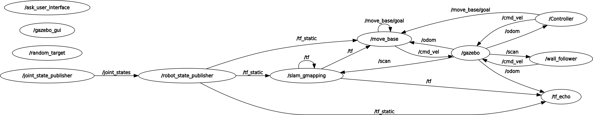
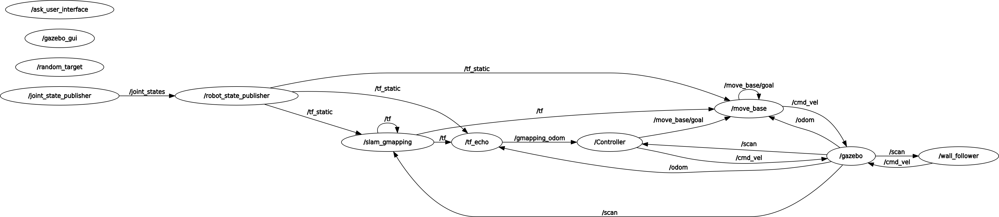
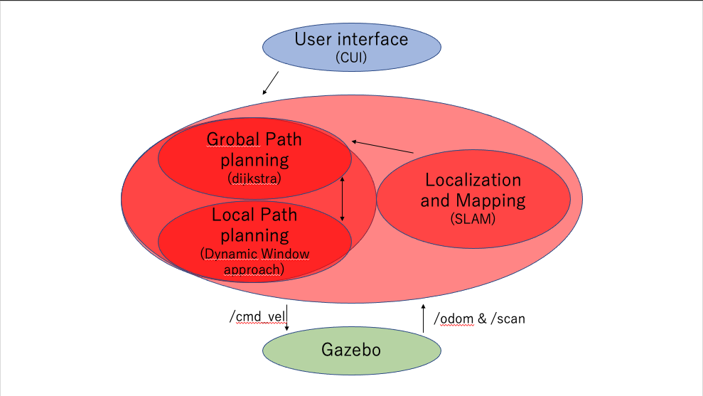

# Research Track I - final assignment
Student ID:5053193
Name: Yuji Aoki

## Requirements
The non holonomic robot(gazebo) should be working as following below,
1.  move randomly in the environment , by choosing 1 out of 6 possible target positions:[(4, 3);(4,2);(4,7);(5, 7);(5, 3);(5,1)], implementing a random position service as in the assignment 1
2. directly ask the user for the next target position (checking that the position is one of the possible six ) and reach it
3. start following the external walls
4. stop in the last position

## Description of the content of package
### Node
- `/Controller`
- `/ask_user_interface`
- `/random_target`
- `/wall_follower`

### Topic
- /odom
    - Type: `nav_msgs/Odometry`
    - Publisher node: `/gazebo`
    - Subscriber node: `/Controller`
<!-- - /gmapping_odom
    - Type: `geometry_msgs/Twist`
    - Publisher node: `/tf_echo`
    - Subscriber node: `/Controller` -->
- /cmd_vel 
    - Type: `geometry_msgs/Twist`
    - Publisher node: `/Controller`,`/wall_follower`
    - Subscriber node:` /gazebo`
- /move_base/goal 
    - Type: `move_base_msgs/MoveBaseActionGoal`
    - Publisher node: `/Controller`
    - Subscriber node: `/move_base`
### Service
- /random_target
    - Type : Empty
    - Client node: `/Controller`
    - Server node: `/random_target`
- /ask_user_interface
    - Type : Empty
    - Client node: `/Controller`
    - Server node: `/ask_user_interface`
- /wall_follower_switch  
    - Type : SetBool
    - Client node: `/Controller`
    - Server node: `/wall_follower`

## Computational graph of the system

<!--  -->
## Robot behaivors implemented
`/Controller` node is composed of 4 states as following below.
#### state0 - setting random target
#### state1 - asking user interface
#### state2 - start following the external walls
#### state3 - stop in the last position after the robot runs around the walls (whole map)

0. `/Controller` node calls for `/random_target` in order to get random target position among [(-4,-3),(-4,2),(-4,7),(5,-7),(5,-3),(5,1)], and `/Controller `publishes the target position for `/move_base`. After that, the robot starts to move for target.

1. When the robot arrives the target,`/Controller` node calls for `/ask_user_interface`. Next, `/ask_user_interface` node asks the request on command line. and check if the request position is feasible(among [(-4,-3),(-4,2),(-4,7),(5,-7),(5,-3),(5,1)]) or not. And if it is ok, updates the target position and `/Controller `publishes the target position for `/move_base`. (If it's not feasible target, `/ask_user_interface` asks again) After that, the robot starts to move for target same as state 0.

2. When the robot arrives the target, `/Controller` node calls for `wall_follower`. and after the robot run around the map, it switches to state3.

3. When the robot arrives the target `/ask_user_interface` gave, the robot stops.

## Software architecture
The blue part is user interface. By using this module, I can interact with the robot controller by setting some parameters (in this caes, setting the target position).

The red parts are the ones which implements the actulal robot controller. it processes the inputs comming from gazebo(`/odom`,`/scan`)&user interface and it set a resulting linear and angular velocity for the robot(`/cmd_vel`). And `Controller` node is managing  current position and target position. In detail, the robot gets the map by using SLAM and plans the path from the current position to the target position by grobal Path planning(dijkstra) and the robot is moving while avoiding obstacles by using local path planning.

All the green components represent the section of the system which simulate the robot and its physical interaction with the environment.




## System’s limitations and possible improvements

1. Possiblity of changing path on the way
In this system,the robot is moving for target while creating the map by SLAM algorithm, so the path created when the robot is in the initial position is not always optimal path because there is a possibility the robot doesn't notice obstacles. So the robot sometimes changes path, in some case it contributes to detour. And the point is that we already know how the map is. That's why I think I can improve creating optimal path by using amcl which estimate the current position by pattern matching with pre-existing maps and lasar data. 

2. Limited to static environment
In this system, the robot cannot avoid moving obstacles. But in real environments, we always need to consider moving obstacles. So I have to learn the algorithm and technique which enables robot to move safely even in dynamic environments.


## Instructions about how to run the code

```
roslaunch final_assignment simulation_gmapping.launch
```

```
roslaunch final_assignment move_base.launch
```
(the nodes I created are included in move_base.launch)


